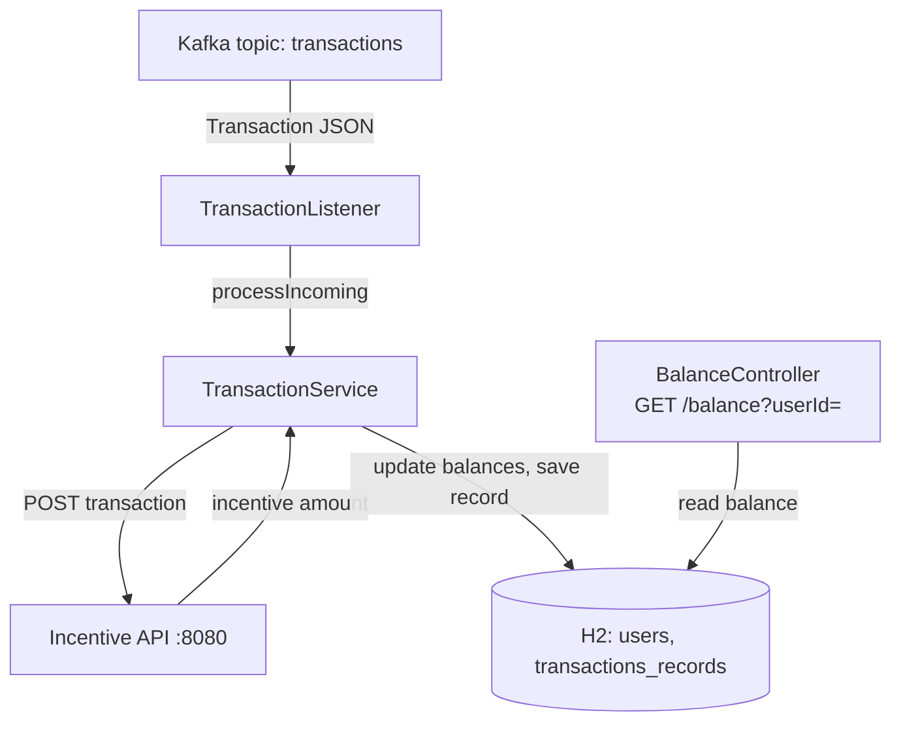

# Midas Core

A transaction-processing service built for JPMorgan Chase's **Advanced Software Engineering job simulation** on [Forage](https://www.theforage.com/) (completed August 2025).

Midas Core consumes money transfers from a Kafka topic, validates them, asks an external incentive API for a bonus, updates user balances in a database, and exposes balances over REST.

> Forage provided the project skeleton, the domain classes (`UserRecord`, `Transaction`, `Balance`) and the test harness. My work is listed under [What I built](#what-i-built).

## Architecture



## Tech stack

Java 17 · Spring Boot 3.2 · Spring Kafka · Spring Data JPA · H2 (in-memory) · Maven Wrapper · JUnit 5 with embedded Kafka

## What I built

**Simulation tasks 3–5 (Aug 2025)**
- Kafka listener that deserialises incoming transactions and hands them to a transactional service
- Validation: sender and recipient must exist, the amount must be positive, and the sender must have sufficient funds
- JPA entity and repository for transaction records, linked to sender and recipient users
- Call to the external incentive API; the incentive is credited to the recipient on top of the transfer
- `GET /balance?userId=` REST endpoint

**Follow-up fixes (Sep 2026)**
- **Listener in the wrong source set.** The Kafka listener sat in `src/test`, so it only existed on the test classpath and the packaged service consumed nothing. It now lives in `src/main` as `TransactionListener`; the rename also stops it shadowing Spring's `@KafkaListener` annotation.
- **Swallowed failures.** A `catch (Exception ignored)` around the incentive call hid outages and bugs, silently crediting a zero incentive. Failures now propagate (see below).
- **Silent rejections.** Invalid transactions were dropped without a trace; each rejection is now logged with its reason.

## Failure handling

Failures are split by whether retrying can help:

| Failure | Kind | Behaviour |
|---|---|---|
| Unknown sender or recipient | Permanent | Logged as a warning, transaction skipped |
| Non-positive amount | Permanent | Logged as a warning, transaction skipped |
| Insufficient funds | Permanent | Logged as a warning, transaction skipped |
| Incentive API unreachable or erroring | Transient | Exception propagates; `@Transactional` rolls back; Spring Kafka's default error handler redelivers the record, then logs an error and skips it |
| Incentive API returns an empty body | Contract breach | Transfer is processed with a zero incentive and a warning is logged |

## Running it

**Prerequisites:** JDK 17 or newer. Maven is not needed; the Maven Wrapper downloads it on first use.

```bash
# Terminal 1: start the incentive API
java -jar services/transaction-incentive-api.jar

# Terminal 2: build and run the Task 5 harness (starts its own embedded Kafka)
./mvnw test -Dtest=TaskFiveTests
```

The harness prints the resulting balances between `---begin output ---` and `---end output ---`. Stopping the incentive API and re-running shows the retry-then-skip behaviour in the logs.

Running the service on its own (`./mvnw spring-boot:run`, port 33400) requires a Kafka broker on `localhost:9092`.

## Design notes and known limitations

- **Money as `float`.** The template stores balances as `float`, and the test harness parses them with `Float.parseFloat`, so I kept it. Binary floating point cannot represent values like 0.10 exactly, and rounding errors accumulate across transfers. A production ledger would use `BigDecimal` with an explicit `RoundingMode`, or integer minor units (pence).
- **Network call inside a database transaction.** The incentive request happens inside the `@Transactional` method, so a database transaction stays open during network I/O. At scale, the call would be made first and the transaction kept short.
- **Retries without backoff or a dead-letter topic.** The default error handler retries immediately and then drops the record after logging it. Production would add an exponential backoff and publish exhausted records to a dead-letter topic for reconciliation.
- **Empty incentive responses** are credited as zero rather than retried, which keeps the transfer flowing but records an incomplete incentive.
- **In-memory H2.** All data is lost on restart; fine for the simulation, not for real use.
